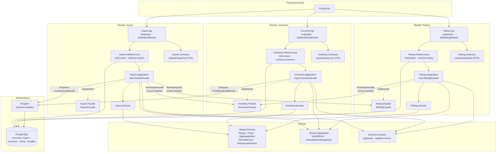

# Components Diagram



## Granice modułów

Kompilator wymusza granice — moduł-konsument referencuje wyłącznie `*.Facade`, nigdy `*.Application` ani `*.Domain` innego modułu.

| Komunikacja | Mechanizm |
|-------------|-----------|
| In-process sync (side effecty UoW) | `IDomainEventDispatcher` |
| Cross-module async (durable, retry) | Hangfire `IBackgroundJobClient.Enqueue` |
| Cross-module sync (query) | `IXxxFacade` — implementacja w `*.Application` |

## Główny przepływ ingestii

```
POST /import/{contextId}/run
  → Import.Application → UoW.SaveChanges
    → DomainEventDispatcher → IngestionCompletedHandler
      → IInventoryFacade.ProcessImportedDataAsync
        → Hangfire.Enqueue<InventoryUpdateJob>
          → Inventory: SKU→EAN · aktualizacja cen bazowych
            → IRatingFacade.TriggerPriceRecalculationAsync
              → Hangfire.Enqueue<PriceRecalculationJob>
                → Rating: pre-kalkulacja cennika
```
